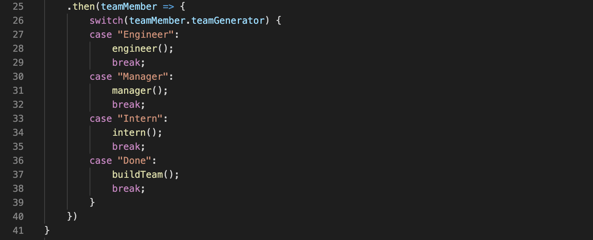

# employee summary


## Table of Content
- Objective
- Deploy Link
- Getting Started
- Code Highlights
- Technology
- Author 

## Objectives
You will build a software engineering team generator command line application. The application will prompt the user for information about the team manager and then information about the team members. The user can input any number of team members, and they may be a mix of engineers and interns. This assignment must also pass all unit tests. When the user has completed building the team, the application will create an HTML file that displays a nicely formatted team roster based on the information provided by the user.

## Deploy Link

https://ayladillis.github.io/employee_summary/

## Getting Started
These instructions will get you a copy of the project up and running on your local machine for development and testing purposes. See deployment for notes on how to deploy the project on a live system.

```
$ git clone git@github.com:ayladillis/employee_summary.git
ayladillis/employee_summary.git
$ cd ayladillis/employee_summary.git
```
Then open in your preferred text editor:
- [vim](https://www.vim.org/) 
- [emmacs](https://www.gnu.org/software/emacs/)
- [visual studio code](https://code.visualstudio.com/) 

## Code Highlight
I used the switch statement to match the expression value to the case clause, and execute the associated statement; 'Engineer', 'Manager', 'Intern' and 'Done'.



## Technology
* [Javascript](https://developer.mozilla.org/en-US/docs/Web/JavaScrip)
* [Node.js](https://node.js.org/)


## Authors 
- [Ayla Dillis](https://github.com/ayladillis)
- email: aayladillis@gmail.com